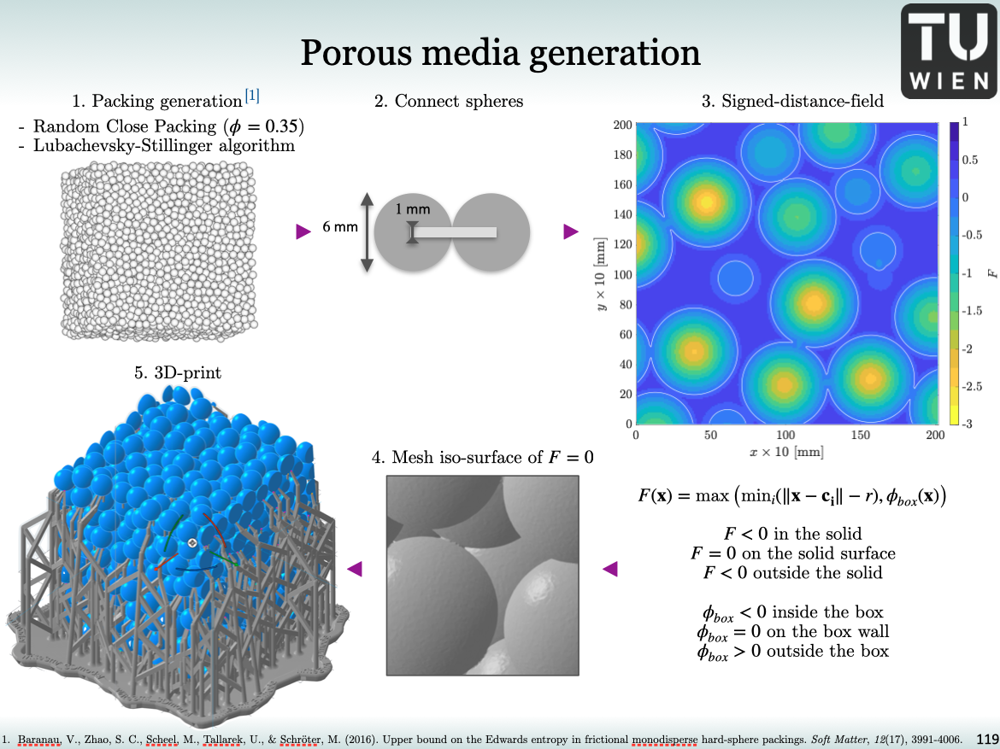

# rcps-3dprint

**Reproducible random close-packed sphere lattices for 3D-printable porous-media experiments.**

`rcps-3dprint` turns a simulated random close packing (RCP) of spheres into a
watertight, printable `.3mf` solid — spheres connected by small cylindrical
bridges, cut into exact tiles, optionally assembled into multi-tile facilities
whose tiles physically interlock. A guided browser GUI covers the whole
workflow; a CLI and a Python API expose every step.



## Why

Experiments on flow through porous media (Darcy/Forchheimer characterization,
Horton–Rogers–Lapwood convection, dispersion, …) traditionally fill the test
cell with poured glass spheres. That practice has three well-known problems:

1. **Irreproducibility** — pouring never produces the same configuration
   twice, so porosity and permeability differ between experiments and between
   labs, with an uncertainty that is hard to quantify.
2. **Packing protocols** — reaching dense random packing requires vibration or
   tapping protocols that are impractical around sensitive instrumentation.
3. **Wall effects** — poured packings are systematically looser near walls,
   locally increasing permeability and biasing measurements.

3D printing the *same simulated packing* for every experiment removes all
three: the geometry is identical across prints and labs, the bulk porosity is
preserved right up to the domain faces (periodic ghost spheres are included
before the tile is cut), and the configuration is a citable digital artifact.
A growing literature uses 3D-printed porous media in exactly this spirit —
see [References](#references).

## What you get

- **`rcps-gui`** — a local browser app guiding the full workflow:
  **Setup** (clone + build the packing generator automatically, point to an
  existing executable, load an existing `packing.xyzd`, or use Google Colab) →
  **Pack** (simulate; live 3D preview) → **Mesh** (fast coarse preview,
  porosity and watertightness readout) → **Export** (production `.3mf`,
  single tile or interlocking facility with an assembly map). Fully
  on-device; every packing gets its own `output/run_*/` folder.
- **`rcps-build`** — single-tile CLI: YAML config in, `.3mf` + sidecars out.
- **`rcps-facility`** — multi-tile orchestrator: derives the unique tile
  types of an N×M×K facility (e.g. 4·4·1 → 9 meshes for 16 tiles), meshes
  each once, and writes an assembly map.
- **`rcps`** — the underlying Python package (NumPy-based SDF construction,
  meshing, validation metrics).
- **`matlab/RCPS_v5.m`** — a maintained MATLAB implementation of the same
  pipeline for MATLAB users (see `matlab/README.md`).

## Install

```bash
git clone https://github.com/VladGiurgiu0/rcps-3dprint.git
cd rcps-3dprint

# create and activate a fresh Python environment (either tool works):
python3 -m venv .venv && source .venv/bin/activate      # standard Python
# conda create -n rcps python=3.11 && conda activate rcps  # or conda

pip install -e ".[skimage]"   # the package + all dependencies + preview mesher
```

Python ≥ 3.10. The virtual environment is not strictly required, but it keeps
this project's dependencies (iso2mesh, pymeshfix, trimesh, …) isolated from
the rest of your system — activate it again (`source .venv/bin/activate` or
`conda activate rcps`) whenever you come back to use the tools. The GUI needs no extra dependencies (standard library plus a
vendored `three.js` for offline 3D previews). Building the packing generator
from the GUI requires `git` and a C++ compiler (macOS:
`xcode-select --install`; if compilation reports `'string' file not found`,
the GUI applies an SDK fallback automatically and tells you in the log).

## Quick start

```bash
rcps-gui                      # opens http://127.0.0.1:8421 in your browser
```

or, without the GUI:

```bash
rcps-build examples/config_50mm_d6_phi035.yaml
rcps-facility examples/config_50mm_d6_phi035.yaml --grid 4 4 1 --diameter design --dry-run
```

## Methodology

### 1. Packing generation

Sphere configurations come from Vasili Baranau's
[PackingGeneration](https://github.com/VasiliBaranov/packing-generation)
(MIT, **not bundled** — built on your machine or run in
[Colab](https://colab.research.google.com/drive/1bgj9sSHnXJZjiG9aw09_NAw1YoZJRMmu?usp=sharing)).
The proven sequence is a force-biased start followed by Lubachevsky–
Stillinger densification (`-fba` → `-ls` → `-lsgd`) in a triply periodic box.
You specify sphere diameter d, box edge L, target porosity φ, seed and
contraction rate; the number of spheres follows as
N = ⌊(1−φ)·L³/(πd³/6)⌋.

**Diameter convention.** The generator keeps the *nominal* diameter in
`packing.xyzd` and reports the true jammed size as a ratio (its "inner
diameter ratio"; see
[packing-generation#30](https://github.com/VasiliBaranov/packing-generation/issues/30)).
rcps rescales the file to the **true jammed diameters**
(scale = ((1−φ_final)/(1−φ_theoretical))^(1/3), which equals the generator's
reported ratio) and records the provenance in `packing_meta.json` — so
`packing.xyzd` always describes real, tangent-contact geometry.

A note on conventions: this README uses φ for **porosity** (void fraction),
as is customary in porous-media work. The sphere-packing literature quotes
the complementary **packing density** — random close packing of equal
spheres is ≈ 0.64 (Baranau & Tallarek 2014), i.e. porosity ≈ 0.36. A request
of φ = 0.35 therefore typically jams at φ ≈ 0.36.

**Printed-diameter choice (explicit, per print):**

| Option | Geometry | Porosity |
|---|---|---|
| *As simulated* | exact jammed packing, point contacts | as achieved (≈ 0.36) |
| *Inflated to nominal d* | ~tens of µm overlap at every contact (stronger print) | as requested (e.g. 0.35) |

### 2. Implicit solid (signed distance field)

The tile solid is built as a float32 narrow-band signed distance field on a
uniform voxel grid (negative inside): the union of all spheres — **including
periodic ghost images**, so boundary porosity equals bulk porosity —
intersected with the tile box `[0,L]³` (a strict box SDF; cut faces land
exactly on the tile planes). Pore-space export uses the complement inside the
box, `max(F_box, −F_beads)`, and is verified by a volume-partition test
(V_beads + V_pore = V_box).

### 3. Bridges

A bare RCP lattice touches only at points and cannot be printed. At every
contact (gap ≤ `contact_tol`, default 0.2 mm) a cylinder of radius
`radius_frac × min(r_i, r_j)` (default 0.15) is unioned into the field,
adding ≲ 0.1% solid but making the lattice self-supporting.

### 4. Tiles that interlock (`keep_sides`, facilities)

Faces listed in `keep_sides` are *not* cut: spheres protrude past them, and a
half-open ownership rule (center ∈ [0, L) per kept axis) assigns every sphere
to exactly one tile — including spheres centered exactly on a shared plane.
Two neighbours that both keep their shared face therefore interlock
mechanically, because the packing is periodic. `rcps-facility` automates
this: interior faces kept, exterior faces cut flush, one mesh per *unique*
tile type, plus a human-readable assembly map (which mesh at which grid
position, copy counts).

### 5. Meshing, repair, output

The iso-surface F = 0 is triangulated by **iso2mesh** (CGAL restricted
Delaunay; the validated production backend) or **scikit-image** marching
cubes (fast preview). CGAL quality knobs: `angbound` (min triangle angle),
`radbound` (max triangle size, voxels), `distbound` (max surface deviation,
voxels), `maxnode` (node cap). The mesh is repaired with **pymeshfix**,
checked (watertightness, manifoldness, degenerate faces), and written as
`.3mf` with two sidecars: `_info.txt` (human-readable) and `.config.json`
(machine-readable: full config, `packing.xyzd` SHA-256, package version,
timestamp) for exact reproducibility. Mesh size scales ∝ vox⁻², peak memory
∝ vox⁻³ (a guard refuses grids beyond ~5×10⁸ voxels); 0.1 mm voxels are the
validated production resolution for d = 6 mm spheres.

## Validation

The Python pipeline was validated against an independent MATLAB
implementation **and** against analytic ground truth computed directly from
the sphere centers (`data_example/`, 718 spheres, 50 mm tile, vox = 0.1 mm):

| Metric | Python vs MATLAB reference |
|---|---|
| Solid volume | Δ = **0.003%** |
| Porosity | \|Δφ\| = **1.6×10⁻⁵** |
| Surface area | Δ = **0.13%** |
| Bounding box | L∞ = **0.62 µm** |
| Watertight | yes (strict) |

Both implementations agree with the analytic packing volume to within 0.016%,
and the mesh frame is guaranteed: flush-cut faces lie on `[0, L]³` to < 1 µm.
The full suite runs with `pytest` (the MATLAB-comparison tier auto-skips
unless the reference mesh is present; regenerate it with
`tests/fixtures/generate_reference.m`). See `tests/fixtures/README.md` for
the validation protocol and audit trail.

## Repository layout

```
rcps/            Python package (SDF, bridges, meshing, facility orchestrator, CLI)
rcps_gui/        browser GUI (stdlib server; vendored three.js for previews)
matlab/          RCPS_v5.m (maintained) · legacy/ (frozen reference implementation)
tests/           validation suite + reference-mesh protocol
examples/        ready-to-run CLI configuration
data_example/    example packing (718 spheres, 50 mm tile)
notebooks/       packing-generation reference notebook (as run in Colab)
```

## Citing

If you use this software, please cite it (see [`CITATION.cff`](CITATION.cff);
a Zenodo DOI is planned for the v1.0 release). If you use packings produced
with PackingGeneration, its authors ask you to cite Baranau & Tallarek
(2017) [doi:10.1063/1.4999483](https://doi.org/10.1063/1.4999483) or
Baranau & Tallarek (2021)
[doi:10.1063/5.0036411](https://doi.org/10.1063/5.0036411). Meshing relies on
iso2mesh (Fang & Boas 2009) and MeshFix (Attene 2010).

## Third-party components and licenses

This repository ships **no pre-built binaries** and bundles no third-party
code except one clearly-marked file. What we use, and under which license:

| Component | License | How it is used |
|---|---|---|
| [packing-generation](https://github.com/VasiliBaranov/packing-generation) (V. Baranau) | MIT | **Not bundled.** `rcps-gui` clones and compiles it on *your* machine (or you run it in Colab). Citation request above. |
| [iso2mesh](https://github.com/fangq/iso2mesh) | GPL-2.0+ | pip dependency (CGAL surface meshing). Not redistributed here. |
| [pymeshfix](https://github.com/pyvista/pymeshfix) | GPL-3.0+ | pip dependency (mesh repair). Not redistributed here. |
| [three.js](https://github.com/mrdoob/three.js) r128 | MIT | The **only vendored file**: `rcps_gui/static/vendor/three.min.js`, unmodified, for offline 3D previews; license text alongside ([`LICENSE-three.txt`](rcps_gui/static/vendor/LICENSE-three.txt)). |
| trimesh, NumPy, SciPy, PyYAML, lxml, scikit-image | MIT / BSD | pip dependencies. |

Full details and redistribution implications: [`NOTICE`](NOTICE).

## References

**Methods used by this pipeline**

- Baranau, V. & Tallarek, U. (2014). Random-close packing limits for monodisperse and polydisperse hard spheres. *Soft Matter* 10, 3826–3841. [doi:10.1039/C3SM52959B](https://doi.org/10.1039/C3SM52959B)
- Baranau, V. & Tallarek, U. (2017). Another resolution of the configurational entropy paradox as applied to hard spheres. *J. Chem. Phys.* 147, 224503. [doi:10.1063/1.4999483](https://doi.org/10.1063/1.4999483)
- Baranau, V. & Tallarek, U. (2021). Beyond Salsburg–Wood: glass equation of state for polydisperse hard spheres. *AIP Advances* 11, 035311. [doi:10.1063/5.0036411](https://doi.org/10.1063/5.0036411)
- Baranau, V., Zhao, S.-C., Scheel, M., Tallarek, U. & Schröter, M. (2016). Upper bound on the Edwards entropy in frictional monodisperse hard-sphere packings. *Soft Matter* 12, 3991–4006.
- Fang, Q. & Boas, D. A. (2009). Tetrahedral mesh generation from volumetric binary and grayscale images. *IEEE ISBI 2009*, 1142–1145.
- Attene, M. (2010). A lightweight approach to repairing digitized polygon meshes. *The Visual Computer* 26, 1393–1406.

**3D-printed porous media in the experimental literature**

- Patiño, J. et al. (2024). Replication of soil analogues at the original scale by 3D printing. *Adv. Water Resour.* [doi:10.1016/j.advwatres.2024.104795](https://doi.org/10.1016/j.advwatres.2024.104795)
- Lee, D. et al. (2024). Stochastically reconstructed 3D porous media micromodels using additive manufacturing. *Sci. Rep.* 14. [doi:10.1038/s41598-024-60075-w](https://doi.org/10.1038/s41598-024-60075-w)
- Cruz-Maya, J. et al. (2023). Three-dimensional printing of synthetic core plugs. *Processes* 11. [doi:10.3390/pr11092530](https://doi.org/10.3390/pr11092530)
- Gjengedal, S. et al. (2020). Fluid flow through 3D-printed particle beds. *Transp. Porous Media*. [doi:10.1007/s11242-020-01432-x](https://doi.org/10.1007/s11242-020-01432-x)
- Penubarthi, G. et al. (2025). Experimental and computational fluid dynamics of 3D-printed TPMS and lattice porous structures. *Micromachines* 16. [doi:10.3390/mi16080883](https://doi.org/10.3390/mi16080883)
- Ibrahim, E. et al. (2021). Porosity and permeability of synthetic and real rock models using 3D printing and digital rock physics. *ACS Omega*. [doi:10.1021/acsomega.1c04429](https://doi.org/10.1021/acsomega.1c04429)
- Gueven, I. et al. (2017). Hydraulic properties of porous sintered glass bead systems. *Granular Matter* 19. [doi:10.1007/s10035-017-0705-x](https://doi.org/10.1007/s10035-017-0705-x)
- Mohammed, A. et al. (2020). 3D-printed hierarchical porous covalent organic framework foams. *J. Am. Chem. Soc.* [doi:10.1021/jacs.0c00555](https://doi.org/10.1021/jacs.0c00555)
- Wei, D., Wang, Z., Pereira, J.-M. & Gan, Y. (2021). Permeability of uniformly graded 3D printed granular media. *Geophys. Res. Lett.* 48. [doi:10.1029/2020gl090728](https://doi.org/10.1029/2020gl090728)
- Guo, R. et al. (2023). 3D-printed fluidics for miscible density-driven convection in porous media. *Adv. Water Resour.* [doi:10.1016/j.advwatres.2023.104496](https://doi.org/10.1016/j.advwatres.2023.104496)
- Kondo, A. et al. (2017). Reproduction of a discrete element model by 3D printing and its experimental validation on permeability. *Springer Proc.* 517–524. [doi:10.1007/978-3-319-52773-4_62](https://doi.org/10.1007/978-3-319-52773-4_62)

## License

MIT — see [`LICENSE`](LICENSE). The GPL licenses of iso2mesh and pymeshfix
apply to combined works assembled when those pip dependencies are installed;
see [`NOTICE`](NOTICE).
